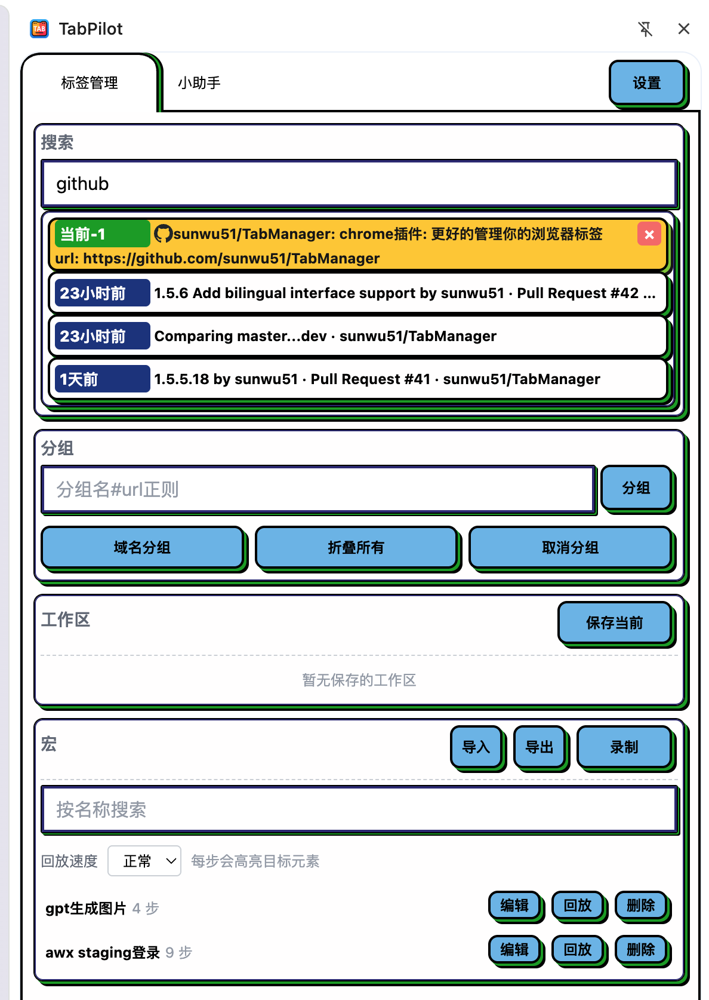
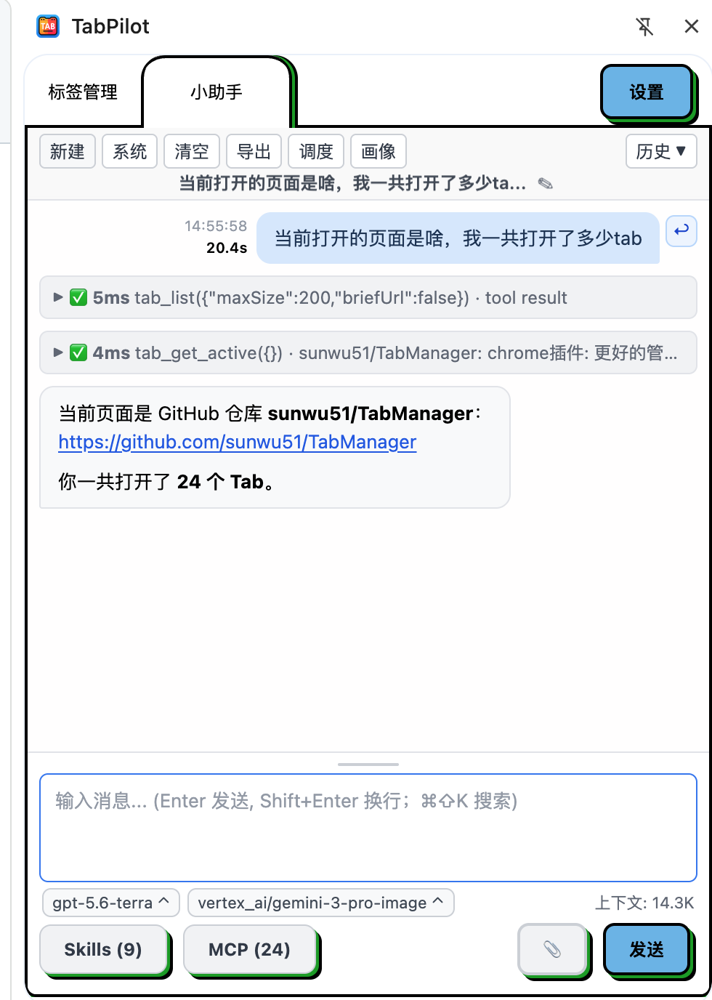

<p align="center">
  
</p>

<p align="center">
  <strong>把混乱的标签页变成清晰的工作台，再让 AI 替你完成浏览器里的琐事。</strong>
</p>

<p align="center">
  <a href="https://chromewebstore.google.com/detail/tab-manager/kklpijbnmbkpgcmnldimiagiehbakaec">Chrome 商店</a>
  · <a href="README.md">英文版</a>
</p>

## 一个侧边栏，更少切换，更多专注

TabPilot 是一款 AI 驱动的 Chrome 侧边栏扩展，面向每天在浏览器里工作、研究和切换大量页面的人。它让浏览器感知型 AI Agent 直接参与当前工作，再将标签页检索、分组、工作区和暂存内容集中在同一个地方。

## 核心能力

| | 能做什么 |
| --- | --- |
| ✨ **浏览器内 AI Agent** | AI 可结合标签页、窗口、分组、历史、页面 DOM、截图和页面执行能力，直接在侧边栏协助完成任务。 |
| 🔌 **不断扩展的 Agent** | 接入 HTTP MCP 或其他 Chrome 插件提供的 MCP 工具；也可通过 WebSocket Bridge 将 TabPilot 工具提供给外部客户端。 |
| ⏱️ **把重复操作变成自动化** | 录制和回放宏，保存或导出对话，并按计划执行工具任务。 |
| 🔎 **快速找回页面** | 按标题或 URL 搜索当前标签页；页面关闭后，也能从浏览历史中找回。 |
| 🗂️ **一键整理标签** | 按域名或自定义规则分组，支持折叠和批量整理，让拥挤窗口迅速恢复秩序。 |
| 🧠 **保存工作现场** | 将一组页面保存为工作区或暂存内容；恢复时自动避免重复打开。 |
| ☁️ **配置随时迁移** | 支持设置导入导出，以及通过 GitHub 同步设置和暂存内容。 |

## 截图

> 截图准备好后，放入 `docs/screenshots/` 目录即可自动显示。

<table>
  <tr>
    <td width="50%"></td>
    <td width="50%"></td>
  </tr>
  <tr>
    <td align="center"><strong>1. 标签总览</strong><br />展示搜索结果、多个标签分组和工作区控制。</td>
    <td align="center"><strong>2. AI Agent</strong><br />展示真实的提问和工具调用结果，最好带有当前页面上下文。</td>
  </tr>
  <tr>
    <td width="50%"></td>
    <td></td>
  </tr>
  <tr>
    <td align="center"><strong>3. MCP 与自动化</strong><br />展示 MCP 连接、宏、调度或 GitHub 同步中最清晰的一页。</td>
    <td></td>
  </tr>
</table>

## 开始使用

1. 从 [Chrome 商店安装 TabPilot](https://chromewebstore.google.com/detail/tab-manager/kklpijbnmbkpgcmnldimiagiehbakaec)。
2. 打开侧边栏，用 AI Agent 协助处理当前页面，或用搜索和分组整理当前窗口。
3. 在设置中配置模型，即可启用 AI Agent。
4. 需要更多能力时，再连接 MCP 工具或启用自动化。

## 本地开发

```bash
npm install
npm run build
```

在 `chrome://extensions` 打开开发者模式，然后加载生成的 `dist/` 目录。

---

**TabPilot — 少些切换，多些完成。**
